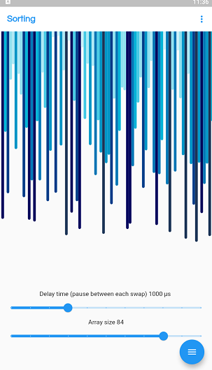
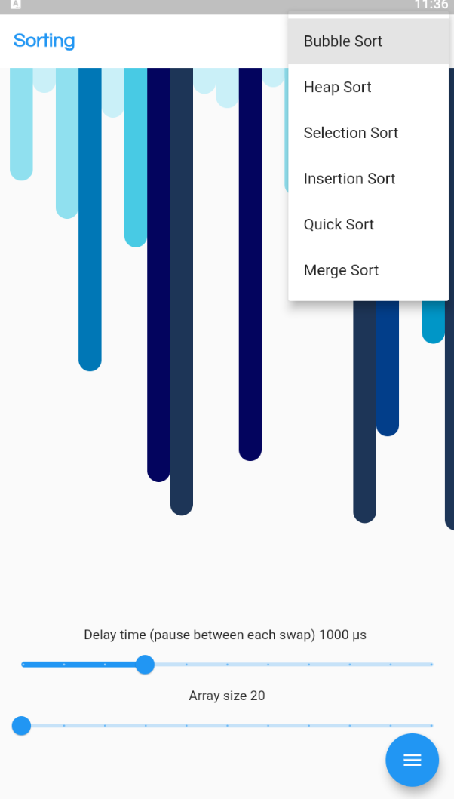
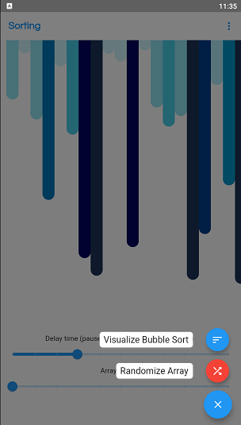
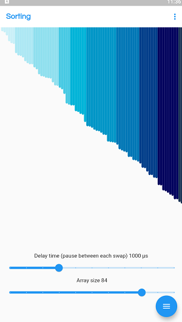

# sorting_algorithm_visualizer

A projects to visualize various sorting algorithms and compare them to each other.

## The following page displays the various array elements as bars, whose length is proportional to element's value. The higher the value the darker the bar. 📈📈

## Using the action in the appbar, user can select between different sorting algorithms and visualize each pf them differenty.

## The floating button holds the option to randomize the array and the sort button displays the current sorting algo that is selected

## This is how it looks after sorting
